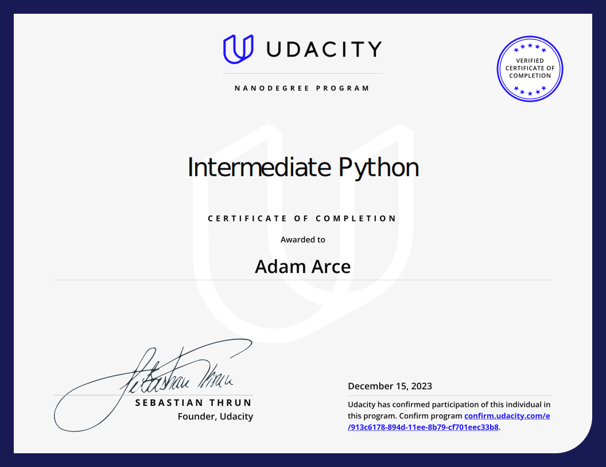

# Intermediate Python Nanodegree

The Udacity Nanodegree implements project-based learning. This directory is a collection of the two projects required. 

## Folder Structure

```bash

|-- README.md
|-- 01-Exploring_Near-Earth_Objects_Project:
|-- |-- inspect_dataset.py
|-- |-- data/
|-- |-- |-- cad.json
|-- |-- |-- neos.csv
|-- |-- database.py
|-- |-- extract.py
|-- |-- filters.py
|-- |-- helpers.py
|-- |-- main.py
|-- |-- models.py
|-- |-- README.md
|-- |-- results.json
|-- |-- tests/
| -- write.py
|-- 02-Motivational_Meme_Generator_Project/
|-- app.py
|-- _data/
|-- fonts/
|-- MemeEngine/
|-- |-- MemeEngine.py
|-- |-- __init__.py
|-- meme.py
|-- QuoteEngine/
|-- |-- FileIngestors.py
|-- |-- Ingestor.py
|-- |-- IngestorInterface.py
|-- |-- QuoteModel.py
|-- |-- __init__.py
|-- README.md
|-- requirements.txt
|-- static/
|-- templates/
|-- tmp/
```

## Project 1: Exploring Near-Earth Objects
### Advanced Python Techniques

In this project, I demonstrate the Advanced Python skills developed throughout this module - to search for and explore close approaches of near-Earth objects (NEOs), using data from NASA/JPL's Center for Near Earth Object Studies. I create a command-line tool to inspect and query NEO data, and futhermore export subsets.

## Project 2: Motivational Meme Generator Project`
### Large Python Codebases with Libraries

In this project, I create a command-line interface and Flask application to generate a dog meme with superimposed quotes.


